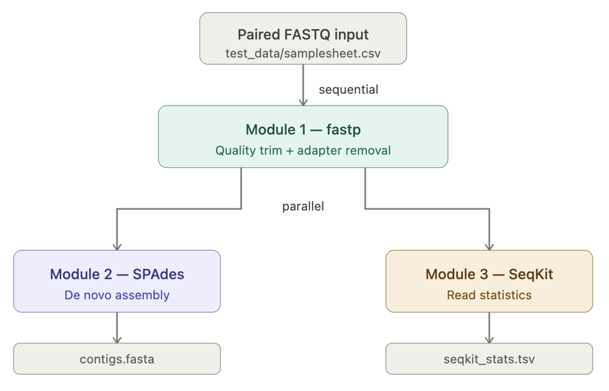

# bacterial-genomics-wf

A minimal **Nextflow DSL2** workflow submitted for **BIOL7210** at Georgia Tech.

- **Sequential:** paired FASTQ reads → `fastp` (quality trimming)
- **Parallel after fastp:** `spades` (assembly) and `seqkit` (read stats) run simultaneously

---

## Workflow diagram



---

## What the pipeline does

1. Reads paired-end FASTQ files listed in `test_data/samplesheet.csv`
2. **Trims and filters reads** with `fastp` (Module 1, sequential)
3. From the cleaned reads, runs two jobs **in parallel**:
   - **Assembles contigs** with `spades` (Module 2)
   - **Computes read statistics** with `seqkit stats` (Module 3)

---

## Features

- **Sequential processing:** raw FASTQ input → fastp
- **Parallel processing:** fastp output is consumed simultaneously by SPAdes and SeqKit
- Runs **locally** by default (no HPC executor needed)
- **Test data included** in the repo under `test_data/`
- All software runs in **Docker containers** — no manual tool installation required

---

## Repo structure

```text
bacterial-genomics-wf/
├── main.nf
├── nextflow.config
├── modules/
│   └── local/
│       ├── fastp/main.nf
│       ├── spades/main.nf
│       └── seqkit/main.nf
├── assets/
│   └── workflow_diagram.png
├── test_data/
│   ├── samplesheet.csv
│   ├── sample01_R1.fastq.gz
│   └── sample01_R2.fastq.gz
└── README.md
```

---

## Requirements

| Item | Value |
|---|---|
| **Nextflow version** | 25.10.4 |
| **Package manager** | Docker 29.2.1 |
| **OS** | macOS (Darwin) |
| **Architecture** | arm64 (Apple Silicon) |

Nextflow itself is managed via a minimal conda environment:
```bash
conda create -n nf -c bioconda nextflow -y
conda activate nf
```

## Software containers

| Tool | Container |
|---|---|
| fastp | `quay.io/biocontainers/fastp:0.23.4--h5f740d0_0` |
| SPAdes | `staphb/spades:4.0.0` |
| SeqKit | `quay.io/biocontainers/seqkit:2.8.2--h9ee0642_0` |

---

## Instructions for running

After Nextflow, conda, and Docker are installed, copy/paste these 3 commands:

```bash
git clone git@github.com:<your-username>/bacterial-genomics-wf.git
cd bacterial-genomics-wf
nextflow run main.nf
```

Docker must be running before executing the pipeline. The test data in `test_data/` is used automatically via `test_data/samplesheet.csv`.

---

## Test data

Test data is included in the repo at `test_data/`:

| File | Description |
|---|---|
| `sample01_R1.fastq.gz` | 10,000 paired-end reads (R1), *E. coli* K-12 |
| `sample01_R2.fastq.gz` | 10,000 paired-end reads (R2), *E. coli* K-12 |
| `samplesheet.csv` | Input manifest pointing to the above files |

Source: [SRR2584863](https://www.ebi.ac.uk/ena/browser/view/SRR2584863) from EBI (subsampled to 10,000 reads for fast runtime).

The samplesheet format:
```csv
sample,fastq_1,fastq_2
sample01,test_data/sample01_R1.fastq.gz,test_data/sample01_R2.fastq.gz
```

---

## Expected outputs

Inside `results/`:

```
results/
├── fastp/sample01/
│   ├── sample01_trimmed_1.fastq.gz
│   ├── sample01_trimmed_2.fastq.gz
│   ├── sample01_fastp.html
│   └── sample01_fastp.json
├── spades/sample01/
│   ├── sample01_contigs.fasta
│   └── sample01_spades.log
└── seqkit/sample01/
    └── sample01_seqkit_stats.tsv
```